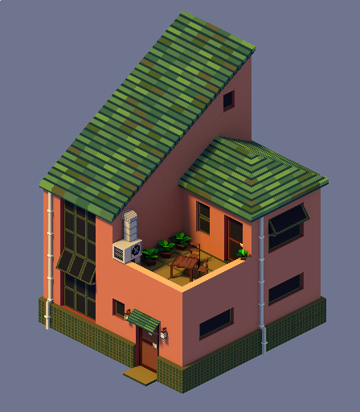

# Other 3d stuff

Playing around with isometric perspective. Camera is angled at (60, 0, 45), and the film pixel filter width is 0.01px to get those sharp pixel edges.  
[Same house from a "trimetric" perspective.](./media/house_tri.png)  
It's satisfying to render 3d models with the clean lines of pixel art. I'd like to make a game in a similar style someday.
{.sidebar-text}

 {.sidebar-media}

---

<video autoplay loop muted playsinline src="media/tv.webm"></video> {.sidebar-media}

Tube TV enemy for a gamejam.  
Some other enemies that I rigged and animated:  
[cat slime](./media/cat.webm)
[floater](./media/floater.webm)
[rolling eye](./media/eye.webm)  
(above 3 designed by Sammy Mahmoudi, and modelled by Richard Klassen)  
We were going for a claymation style. These are captured from Unity, where I made a simple shader that uses 3d noise to adjust color and vertex displacement every few frames. I used constant interpolation in the animations and limited keyframes to every 3-6 frames. Next time I would exaggerate the stop-motion look with even fewer keyframes.
{.sidebar-text}

