# Game Art Portfolio

Hello! Below is some of my 3D and pixel art game work. I'm especially fond of the 3D pixel style.  
I primarily use **Blender**, **Unity**, **GraphicsGale**, and **Krita**.  

I did all **modelling**, **texturing**, **rigging**, and **animation** for the pieces on this page. Many are from games where I made custom shaders and VFX. I've written about some of my experience there in articles for [Dropchute](../dropchute/index.html) and [Ten Minutes to Y2K](../ten2y2k/index.html).

#### In-development FPS roguelite

Here's some characters and animations from an in-progress game. The game uses a PSX-style rendering pipeline so I'm emulating that look to some degree.  
Some parts of these characters are animated with bendy-bones in the game.
{.sidebar-text}

 {.sidebar-media}

 {.sidebar-media}

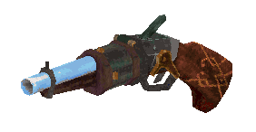  
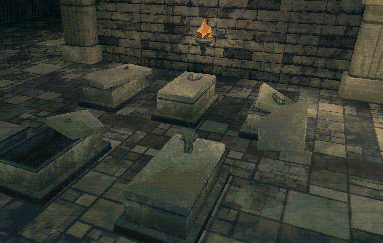  
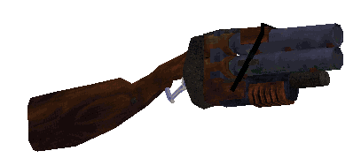 {.sidebar-media}

<video autoplay loop muted playsinline src="media/firstperson.mp4"></video> {.media}

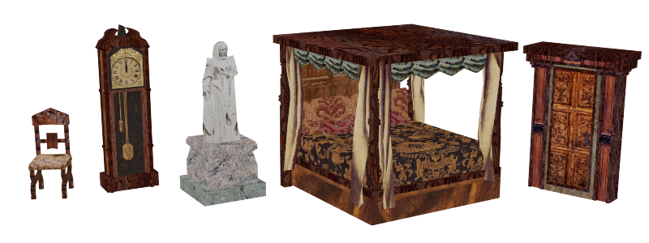 {.media}

#### 10 Minutes to Y2K

Here's a character from the gamejam game *10 Minutes to 2YK*.  
[Read about and play the project here.](../ten2y2k/index.html)  
I made all in-game art/vfx/shaders, though most of it is slap-dash jam art.
{.sidebar-text}

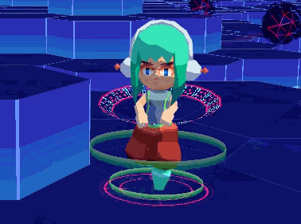 {.sidebar-media}

<video autoplay loop muted playsinline src="media/hero.webm"></video> {.sidebar-media}

#### Scarred Planet Outlaws

This game is an *RTS deckbuilding roguelite* that I worked on a few years ago, but never completed (someday?).  
[Full size game screenshot.](./media/scarred_planet_screen.png)  
These were some of my first 3d models and animations, so I see them as a little rough, but still like their designs. I used a very precise pixel art UV style here as well.
{.sidebar-text}

<video autoplay loop muted playsinline src="media/rebel_leader.webm"></video> {.sidebar-media}

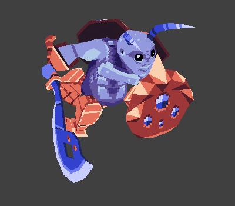 {.sidebar-media}

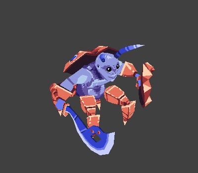 {.sidebar-media}

<video autoplay loop muted playsinline src="media/biker.webm"></video> {.sidebar-media}

<video autoplay loop muted playsinline src="media/turret.webm"></video> {.sidebar-media}

#### Dropchute

I made a 3D version of the game *Downwell*, called *Dropchute*, sticking to color limitations.  
[Read about and play the project (on the web!) here.](../dropchute/index.html)  
The art for this game was mostly an exercise in making cool shaders, but it was really neat to translate the concise designs of the 2D sprites to 3D also.
{.sidebar-text}

<video autoplay loop muted playsinline src="media/dropchute1_enemies.webm"></video> {.media}

#### Miscellaneous 3D art

<video autoplay loop muted playsinline src="media/tv.webm"></video>
Tube TV badnick for a gamejam, I also made this claymation-style shader.  
Right, playing with isometric architecture.  
Below, shots from another gamejam game, [Skyjunk](../skyjunk/index.html).
{.sidebar-text}

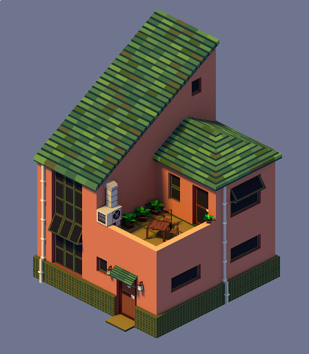 {.sidebar-media}

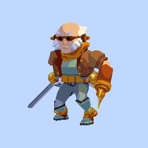 {.sidebar-media}

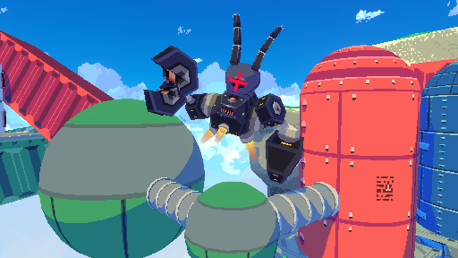 {.sidebar-media}

## Pixel Art

I haven't made pixel art for traditional 2D games in a little while. Here's a pixel dailies piece and some fighting game backgrounds for a jam.

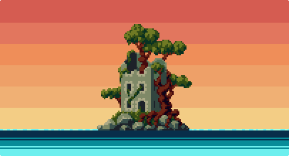
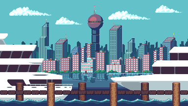
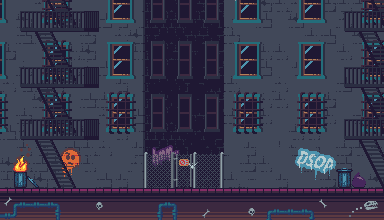 {.media-full-width}

#### Mystic Melee

Below are screens from the pixel platformer I made, **Mystic Melee**. Unfortunately the game isn't complete but for an overambitous first gamedev project I'm happy with how it plays.  
[See it in motion here.](https://www.youtube.com/watch?v=TYYssafX3so)

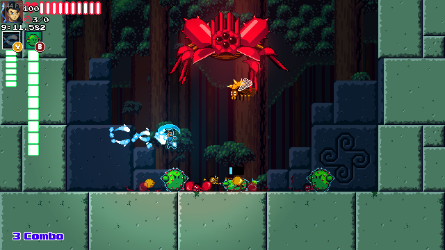 
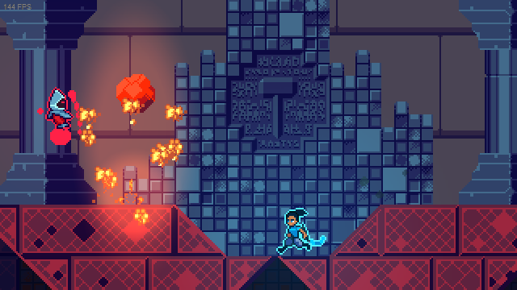 {.media-full-width}

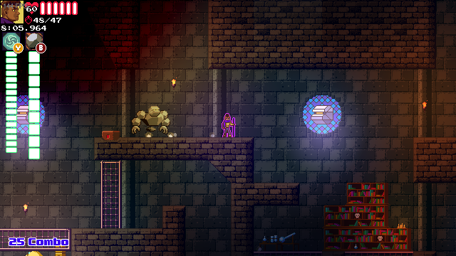 
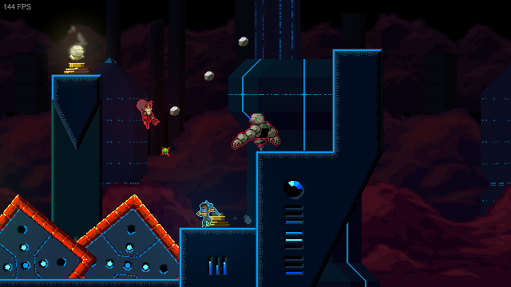 {.media-full-width}

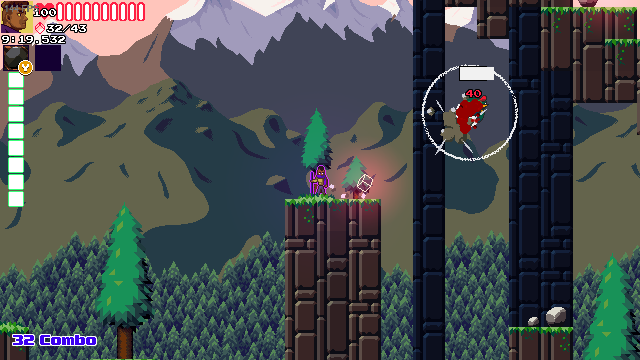 
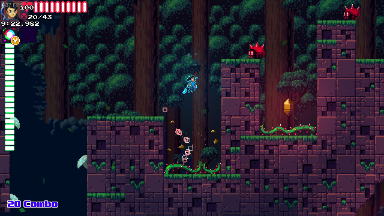 {.media-full-width}

Thanks for looking! If you'd like chat, you can reach me here: 
Discord:    **wexley#9811** 
Email:  **ben.h.hopkins@gmail.com** 
Twitter:    [benhhopkins](https://twitter.com/benhhopkins)

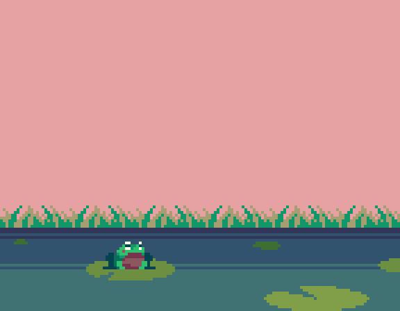 {.media}
