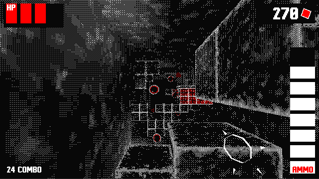
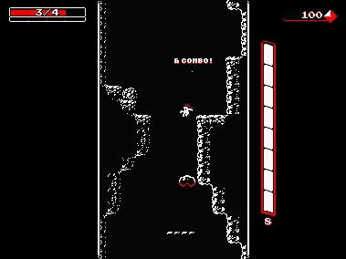
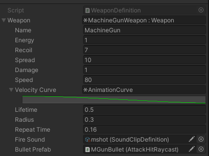
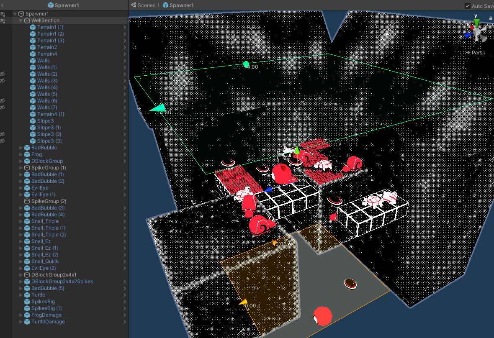
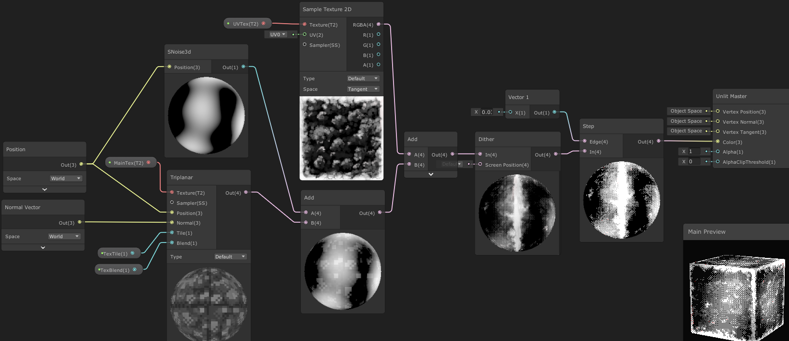

# Dropchute

*An exploration of how Downwell might play in 3d.*

 {.media-fixed-scale}

[Play on itch.io](https://benhhopkins.itch.io/dropchute) {.button .center}

[//]: # (**Development:** Unity, ~1 month, solo)

For [Inspire Jam](https://itch.io/jam/inspirejam), I reinterpreted the game [Downwell](https://www.downwellgame.com/), changing it from a 2d pixel art game to a stylized lowpoly 3d game.

[Goals](#goals)
[Design and Dev](#design)
[Procedural Generation](#gen)
[Shaders](#shaders)
[Audio](#audio)
{.article-contents}

##  Project Goals

- Translate Downwell's mechanical and visual elements into first-person 3d
    - Procedural level generation
    - Some of the same enemies and gunboots (weapons)
    - Caves with shops, gem piles, or weapons
    - Shop items and Combos earn health/energy upgrades
    - Palette swaps!
- Recall the game feel of Downwell - punchy arcade action
- Limit of 3 colors and simple controls, like the original

<video autoplay loop muted playsinline src="dropchute_shop.webm"></video> {.media}

At the shop in **Dropchute**, with the seafoam palette. {.caption}

### Inspirations

I had kicked around the idea of converting a 2d game to 3d since seeing how well it worked for Risk of Rain 1->2. Of course, it's something many game series did in the 90s when 3d gaming emerged. But with indie titles being super creative in the 2d space and with better understanding+tools for 3d games, it feels worth exploring more. Reimagining pixel art games is particularly interesting to me because their visual designs feel dialed-in to the essential forms, simply as a limitation of the medium.

Downwell is one of my favorite short games. It feels very *economical*, simple but perfectly tuned elements work in harmony. This made it a great jumping off point for a jam, even if the functional mechanics were going to be overhauled. I was thrilled to see that the designer of Downwell, [Ojiro Fumoto](https://twitter.com/OjiroFumoto), enjoyed seeing my 3d remix of Downwell.

Playing **Downwell** {.caption}

##  Design and Dev

### Player and Camera

To control the player, I started with the popular [Kinematic Character Controller](https://assetstore.unity.com/packages/tools/physics/kinematic-character-controller-99131). I like how the asset gives you full control of the movement logic while encapsulating the underlying collision system. I hooked that up with Unity's new input system - it has some quirks but I appreciate how it abstracts multiple input types into actions. Even for small projects gamepad input is a priority for me because I just enjoy using one, but most players will use keyboard+mouse.

The player movement is snappy, with high acceleration starting and stopping, identical on the ground and in the air. Jumps are variable height and there's some 'coyote time' after walking off a ledge.

Camera aiming without using the right analog stick or mouse was a fun design challenge. If I could ditch any need to look left or right, I'd only need to adjust the pitch. It seems clear enough that if the player is on the ground they don't want to be looking down, but I also wanted to be able to peek over ledges so you could see what challenges lie below. So to determine the camera pitch, I use a series of raycasts which detect floors and walls in front of the player, as well as other contextual clues like if the player is jumping.

<video autoplay loop muted playsinline src="camera_tilt.webm"></video> {.media}

Red lines / green line are raycasts used to calculate the camera pitch. {.caption}

Implementing caves without camera rotation also required a creative solution. Since the caves are completely safe, you don't need to be able to see where you're going on the way in. So all the cave entrances are on the back-side of the well, allowing the player to see obstacles as they exit the cave. An arrow pointing into the cave should help players know it's safe to back into the entrance.

### Weapons

There are four weapons (/gunboots) in Dropchute. Three are based on Downwell weapons, and one original to this game.
- Machinegun - starter weapon, good ammo/energy efficiency but mediocre range and damage
- Shotgun - 3 energy to fire 8 bullets in a wide spread at short range
- Laser - 4 energy, fires a laser for heavy damage and penetrates enemies
- Rifle - new weapon, notable for longer range which is more relevant in 3d, otherwise a double-power, double-energy machinegun

<video autoplay loop muted playsinline src="shotgun.webm"></video> {.media}

Shotgun, featuring my favorite palette, OldNCold.

Weapons data is stored in `ScriptableObject`s. I use OdinInspector to streamline the process with serialization of polymorphic types. It's a pattern that's functionally the same with vanilla `ScriptableObject` inheritance but for me serializing regular C# classes produces cleaner code, fewer files, and easy extension later if I want nested trees of serialized polymorphic objects.

I tried to replicate some details of how different weapons felt in Downwell. So there's a number of stats for each weapon, controlling recoil, bullet spread, velocity over bullet lifetime, automatic fire rate, etc.  
Even though I only made 4 weapons, I'm happy with how extensible the system is. It's quick to add weapons, and if I added an upgrade/relic system it would be easy to modify weapon attributes on the fly.

 {.media}

### Enemies

The first thing I modeled for this project was some enemies. I love reimagining pixel art sprites in 3d. They simply use vertex colors instead of texturing. I followed some of the Downwell color conventions - enemies that are mostly white on top can be stomped on, mostly red have to be taken out with your weapon.

<video autoplay loop muted playsinline src="dropchute1_enemies.webm"></video> {.media}

All of them are takes on Downwell enemies, but I changed some behaviors. The snails in Dropchute have spikes that fire outwards periodically. The evil eye AI tries to go to a location below the player before attacking them directly - this actually helps them intercept a descending player more often. Enemies have some variations - versions that are faster, have more spikes, or have attachments.

Attachments are a new concept, there are two types: damage crescents and shields. Damage crescents add rotating hurtboxes around an enemy, shields act like the turtle shell and block bullets.

I tried to use these ideas to make navigating the 3d space more challenging. More difficult enemies and variations spawn the further the player falls. In the end, this wasn't enough on its own, I also increase the player's terminal velocity + gravity with depth to make the game difficult. I think with more enemy types and traps it would be possible to have all the difficulty come from a bullet-hell-like descent.

When enemies get stomped or hit by bullets, a hitstop effect amplifies the impact: freezing them in place, boosting their scale, and flashing white.

##  Procedural Generation

The well/chute is generated endlessly from a set of `SectionSpawner` prefabs. Instead of instantiating copies of these prefabs, they're used to create `WellSection`s and `Entity`s.

- `WellSection` holds the static geometry of a level section.
  - This includes the walls and any blocks that always spawn with the well section.
  - The top and bottom bounds and total height of the section are defined here. This allows the `WellBuilder` to fit sections together.
  - A transform for a `CaveInsertionPoint` can be specified if a cave can be inserted into the wall of the section.
  - Use object pooling for efficient creation and removal.
- An `Entity` is any single object that can be spawned with some probability and removed.
  - Use object pooling
  - Enemies, destructible blocks, spikes, and terrain blocks that spawn with some chance all use the `Entity` component.
  - A `Dynamic` boolean notes if the entity can move between well sections (explained later).
  - A `SpawnProbability` controls whether an entity is spawned. This has four factors:
    - base chance
    - depth chance modifier: a positive or negative number that adds or subtracts from the base chance depending on the player depth. E.g. at 300, the base chance will be increased by .5 when the player is at 150 depth.
    - min depth: the depth chance modifier starts counting from this depth, and the entity never spawns above this depth.
    - max chance: the spawn chance will never be increased above this when the depth chance modifier is applied.
- `SpawnProbabilityGroup`s are also tracked by the `SectionSpawner`.
  - Allows linking the chance of spawning multiple entities or terrain blocks
  - For example a group may contain:
    - Destructible blocks with 1.0 spawn chance
    - Enemy that stands on the blocks with 0.5 spawn chance
  - Spawning of the entire group is controlled by a `SpawnProbability`

 {.media-fixed-scale}

`SectionSpawner` prefab, with `WellSection` selected showing the top and bottom sizes.  
All the possible enemies and blocks that have a chance of spawning can be seen. {.caption}

`OnValidate()` is used by `SectionSpawner` to preprocess the children of the prefab root, finding `Entity`s and saving their transform information + a link to their original prefab. Without getting into too much detail on the object pooling system, this allows any `Entity` with the same original prefab to be object pooled together, while using unique transform and `SpawnProbability` settings.

`WellBuilder` creates and removes sections according to the player position. Using the `WellSection` top and bottom bounds, it chooses pieces that are within a threshold of fitting together. A `WellSection` that supports a cave is inserted at a set interval + some random variation. Sections and caves are chosen randomly, but with reduced probability of grabbing the same piece multiple times before other pieces are chosen.

Thresholds are set below the player to create new sections and above the player to remove sections. This is where the `Dynamic` property of entities is used. `WellSection`s store a reference to non-`Dynamic` entities when they're spawned, so these can be removed with the rest of the `WellSection` without checking individual locations. `Dynamic` entities might be moving up and down in the well, so they handle their own removal relative to the player position.

When the player falls too far from the origin, the entire game is moved back up seamlessly to make sure floating point errors aren't introduced.

<video autoplay loop muted playsinline src="droppin2_small.webm"></video> {.media}

Early testing of the `WellBuilder` with a very low   
threshold for rebasing the well back to the origin.  
The player is near the red square. {.caption}

Overall I think the set of pieces I created for well generation (16 total) could have more variation, and there's occasional sloppyness with the placement of some enemies and objects. It would be nice to have more unique gimmick pieces that spawn rarely (like you have to blow up some destructible spike blocks to get through). It's just a bit time consuming to construct and curate many `SectionSpawner` prefabs for a small project.

##  Shaders

### Environment Shader

The game uses URP and all shaders were made with shader graph + a few custom nodes. With just 2 colors for the environment (black and white), I decided to lean heavily into dithering to convey distance and provide visual interest for the terrain.

All the walls and blocks in the game use a terrain shader which mixes:
1. UV Mapped texture
2. Triplanar mapped texture
3. 3D Noise for variation over world position

The grayscale result is overlaid with a screenspace dither, and finally a step node forces the output into black or white.

<video autoplay loop muted playsinline src="dropchute_terrain.webm"></video> {.media}

 {.media-fixed-scale}

Simplified terrain shader example. {.caption}

The full graph has some more features:
- Variables to control the influence of the 3 sources. This way, materials for things such as the destructible blocks can primarily show the UV texture which highlights the edges of the cube. Walls and larger blocks use materials with stronger influence from noise and the triplanar mapped texture.
- The 3D noise repeats over a Y-distance set by script. This is important for the seamless endless falling technique mentioned above, otherwise when the game is snapped back to the origin the wall texture would suddenly have a different noise pattern.

### Object Shaders

Other objects used simple vertex color shaders. For enemies, a variable can brighten the whole mesh when hit by bullets. Gems have a fake reflection using the view normal. Outlines for things like gems and spikes are just implemented in Blender with the flipped normals trick.

The Timebubble is two sphere meshes, red and white vertex colored. Vertex positions are jiggled by noise modulated by time. The shader is transparent (rather than just alpha cutout) so that the depth texture can be used to highlight areas where the bubble nears intersection with terrain. The view normal is also used to make the edges of the bubble visible.

<video autoplay loop muted playsinline src="dropchute_timebubble.webm"></video> {.media}

### Screen Effects

Two shaders are applied to the whole screen, distance fading and the palette. To apply their materials I use two instances of a `ScriptableRendererFeature` named `Blit`, based on [this one by Cyanilux](https://cyangamedev.wordpress.com/2020/06/22/urp-post-processing/) (excellent tutorials about everything URP!). In Dropchute, I use camera stacking to draw the UI/HUD on top of the game, and here it's important to insert the two `Blit` effects one time each in the correct order:
1. Render game camera
2. Apply distance fading
3. Render UI camera
4. Apply palette

By default, the `Blit` features would run at some point during each camera render. Not only is this unnecessary, but the UI would be erased by distance fading when the level geometry behind it was far away. My edit takes a look at some data attached to the Camera component found in `RenderingData` in the `AddRenderPasses` method to only insert the render pass for the correct camera. This works perfectly even though it feels a bit hacky - I'm curious if there's a more elegant way to do it, or if this is just something Unity plans to fix by supporting custom effects in the Volume system.

The distance fading shader looks at the scene depth and uses dithering to fade out objects in the distance. This helps the game look less cluttered and makes falling quickly more risky.

The palette shader uses the incoming color values to sample from a palette texture. A `PaletteSwapper` script references the `Blit` renderer feature to swap the material texture according to a settings menu slider.

 {.sidebar-media}

##  Audio

The sounds and music of Downwell have a wonderful arcadey, crunchy aesthetic (credit [Joonas Turner](https://twitter.com/KissaKolme) and [Eirik Suhrke](https://twitter.com/strotchy)). My amateur sound and music creation for Dropchute involved:
- The [Krush](https://www.tritik.com/product/krush/) VST to emulate some of the creative bitcrushing going on in the Downwell
- [Bleeper](https://pixwlk.itch.io/bleeper) for chiptune-y layers in some sound effects
- Sound effects from Splice
- Bitwig to layer Splice and Bleeper sounds, apply Krush and other effects
- Bitwig to compose the main track below, an above ground variation, and shop music (with a secret alternative inspiration)

Tumblehole.mp3 {.caption}

<audio controls>
  <source src="tumblehole.mp3" type="audio/mp3">
</audio>

 {.hero-image}