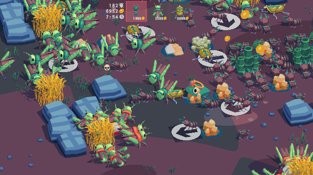
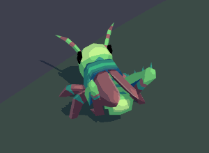
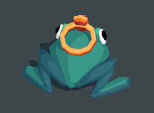
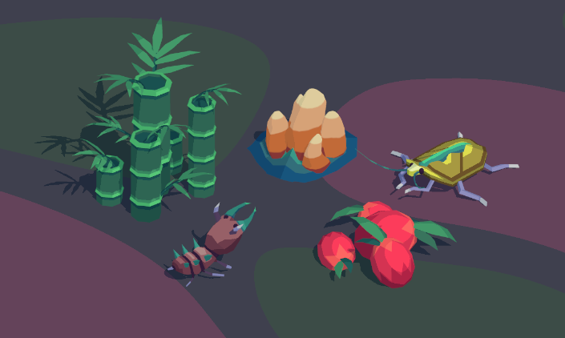

# Empire of Dirt

*Bug empire simulation game.*

 {.media-fixed-scale}

[Play on itch.io](https://benpence.itch.io/empire-of-dirt) {.button .center}

I collaborated with my friend [Ben Pence](https://twitter.com/benpence) on this game for Buddy Jam Spring '22.

Ben led the project, including development, design, and sound effects.  
I worked on the art direction, most models, music, and contributed to the design.

 

Antfarm.mp3 {.caption}

<audio controls>
  <source src="antfarm.mp3" type="audio/mp3">
</audio>

In the game, you play as a frog with the goal of amassing an army of one thousand bugs (the gamejam theme was **one-thousand**). There are three types of bugs, each of which has unique attributes in combat and collects a certain type of resource.

The game is played by building nests to spawn these bugs. With careful nest placement and by plopping down directional hints, you can guide your bugs towards resources and enemies to expand your empire.

 {.media-fixed-scale}

For the visuals, I made a 3-step toon shader with ShaderGraph in Unity that was used for most objects. A terrain shader uses overlapping noise to provide some variation, and a grass shader provides some windy movement to the decorative grass.

 {.media-fixed-scale}

 {.media-fixed-scale}

The models are fairly low-poly, but with smoothed normals which look great in conjunction with the toon shader. I'm happy with how cute the critters turned out to be, a great match for the hilarious sounds Ben made for them.

 {.media-fixed-scale}

Ben created the initial version of some of the above models and I made the finishing touches and textures. {.caption}

Here's a full playthrough of the game:

<iframe style="position: absolute; width: 100%; height: 100%; left: 0; right: 0" src="https://www.youtube.com/embed/vzJhqFS9oW4" title="YouTube video player" frameborder="0" allow="accelerometer; autoplay; clipboard-write; encrypted-media; gyroscope; picture-in-picture" allowfullscreen></iframe>
