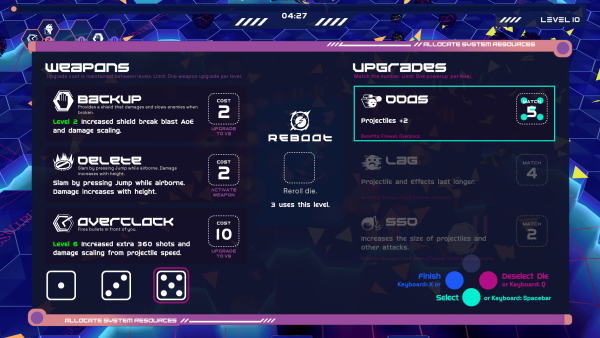
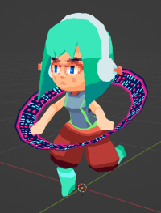
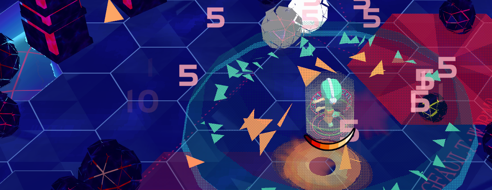

# 10 Minutes to Y2K

*Cyberspace-themed Vampire Survivors-like.*

<video autoplay loop muted playsinline src="hero.webm"></video> {.media-fixed-scale}

[Play on itch.io](https://boz-float.itch.io/10-minutes-to-y2k) {.button .center}

[//]: # (**Development:** Unity, ~2 weeks, team)

*10 Minutes to Y2K* was made in Unity for GMTK gamejam '22. I was the lead programmer, gameplay designer, and 3d+vfx artist. I worked with a small team:

Casey "Boz" Weeks: Game Design, Dice/HUD UI/UX, Programming - [https://boz-float.itch.io/](https://boz-float.itch.io/)  
c0hil: Illustration - Title Screen and Icons - [https://www.instagram.com/c0hil/?hl=en](https://www.instagram.com/c0hil/?hl=en)  
Edward Newton: Enemy Mechanics and Additional Programming - [https://aguynamededward.itch.io/](https://aguynamededward.itch.io/)  
Haberworks: Music - [https://soundcloud.com/haberworks](https://soundcloud.com/haberworks)  
John D. Leon: Sound Effects - [https://www.johndleon.com/](https://www.johndleon.com/)  

[Goals](#goals)
[Gameplay Mechanics](#gameplay)
[Weapons](#weapons)
[Upgrades and Strategy](#upgrades)
[Art and Arena](#art)
{.article-contents}

##  Project Goals

We entered the jam with a plan to make a Vampire Survivors-style game: the player only controls character movement while earning weapons that trigger passively, with the goal of surviving against hordes of enemies until the end of a timer. We wanted to tweak the formula by adding a jump button and making the arena 3D, and planned to adapt the idea further according to the jam theme. The theme was *Roll the Dice*, which was incorporated into our level up mechanics.

My goals/tasks for the jam were to:
- Create a solid foundation for character and enemy movement and interaction.
- Make some fun weapon mechanics and visuals.
- Implement an upgrade system where each weapon could be affected by multiple properties.
- Make some simple character, enemy, and level art - inspired by y2k/psx vibes.

<video autoplay loop muted playsinline src="character.webm"></video> {.media}

Our protagonist launches attack programs at enemies from her virtual-console. {.caption}

##  Gameplay Mechanics

Incorporating a jump button was a big departure from our source formula. It was important that there was a good reason for jumping to be in the game. We accomplished this through:
- 3D map terrain, with elevated tiles and chasms of harmful 'cybersea'.
- Enemies that were fast and often surrounded you, but could be jumped over with proper timing.
- Abilities that interacted with the jump button - hold it to float and press it again to slam.

We were inspired by the jam theme to make dice rolls part of the level up screen. [Boz](https://boz-float.itch.io/) created a neat mechanic where 3 dice are rolled on each level up, which the player can allocate to slots that increase weapon and upgrade power. It adds some depth to your levelling decisions, on top of figuring out how to maximize synergy betweeen your weapons and upgrades.

 {.media}

Upgrade screen by Boz. {.caption}

I adapted some code from my [Dropchute](../dropchute/) project for collision interactions, enemy hitstop, and character control. While enemy behavior simple (just moving directly to the player or to a point), it was a priority to make large numbers of enemies move smoothly across the map. I used the [RVO2](https://gamma.cs.unc.edu/RVO2/) library which simulates collision avoidance for large numbers of agents. This is more performant than using Unity physics, and creates a better flowing movement of enemy agents, even when they want to move in opposing directions.

[Words](https://aguynamededward.itch.io/) helped out with enemy design, with ideas for intimidating monoliths that block aerial movement and hornet-type enemies that are very quick but periodically have to rest briefly. In addition to the slow virus hordes, I created a bunch of levelled variations of these enemies that could be used in increasingly difficult attack waves.

The most interesting part of the game design for me was around designing the weapons and how they would interact with upgrades.

##  Weapons

**Firewall**

- Flame wheels spin around the player and damage enemies.
- As the starter weapon, it encourages feeling out manuevering near enemies, and timing the slow-orbiting wheels gives the player something to interact with that isn't too challenging.
- Most upgrades improve this weapon. Projectile speed and pierce allow it to carry the midgame, with fast-orbiting projectiles hitting each enemy multiple times.
- Downside is that it doesn't have damage scaling, so even with many projectile count, pierce, and speed upgrades it still isn't the best solution for endgame high-HP enemies.

<video autoplay loop muted playsinline src="firewall.webm"></video> {.media}

**Overclock**

- Energy bullets fan out in front of the player, and upgrading the weapon fires additional bullets in random directions.
- The bread-and-butter of a projectile-focused strategy along with Firewall, this one has more damage output but demands aiming towards the greatest threat.
- Also affected by a wide variety of upgrades, but projectile count is important for dealing with high-HP enemies.

<video autoplay loop muted playsinline src="overclock.webm"></video> {.media}

**Delete**

- Pressing jump while airborne slams you to the ground, creating a damaging shockwave that scales in power and size by drop height.
- Provides a small amount of invulnerability-frames when you land, allowing the player to safely stomp directly on enemies *if* the stomp will destroy them. Otherwise, the iframes run out and the player is damaged from overlapping the enemy.
- Jumping off of elevated tiles and slamming at the apex of the jump are critical to getting the most out of this ability.

<video autoplay loop muted playsinline src="delete.webm"></video> {.media}

**Cloud**

- Holding the jump button lets you float and creates damaging clouds.
- Levelling this ability increases damage and makes you extra speedy while floating.
- Duration is the most important upgrade for this ability - extending the total float time.
- Can be a great way to damage enemies early, but lategame it's a very useful escape tool.

<video autoplay loop muted playsinline src="cloud.webm"></video> {.media}

**Backup**

- A shield that provides iframes after being broken, which also creates a blast that damages and slows enemies.
- An easy ability to slot into any build. Even un-levelled, having a shield that can take one hit every ten seconds is helpful.
- Cooldown upgrades can reduce the time between shields, and duration improves the invulnerable time.
- With upgrades, the shield break deals good damage and can slow already sluggish enemies to a standstill.

<video autoplay loop muted playsinline src="backup.webm"></video> {.media}

**Quarantine**

- Nearby hexes are designated for an attack that heavily damages all enemies.
- A very high upside ability for lategame if you can get cooldown, attack size, and damage upgrades.
- More difficult to use early, where compared to other attacks it doesn't offer much protection and sends you scrambling for XP collectables.

<video autoplay loop muted playsinline src="quarantine.webm"></video> {.media}

##  Upgrades and Strategy

There are 10 upgradable stats that can be levelled.
- Attack Size
- Cooldown reduction
- Damage modifier
- Duration increase
- Jump height
- Move speed
- XP collection range
- Projectile count
- Projectile speed / other

In addition a heal upgrade can show up if you have less than 90% health. Each weapon can be improved by multiple stats, so coordinating your weapon and upgrade levels is vital to maximize synergy. A nice thing about making these stat upgrades for a short game is that each level could make a big impact. It's fun to see your attacks get 50% bigger or immediately feel lower cooldowns after a single point into those upgrades.

There are three strategies / archetypes players might succeed with:

**Projectile-focused** strategies are definitely the easiest for newer players to get into, likely because it's hard to go wrong with upgrades and often you're strong mow down opponents before needing to dodge. However, if you haven't collected enough XP, the endgame enemies can be overwhelming.

With upgrades to the jump height and attack size upgrades, a **Delete** strategy can eventually clear the whole screen of small enemies and heavily damage the rest. The midgame is often more difficult for Delete-focused strategies, requiring precise maneuvering to slam as much as possible from elevated tiles without taking damage. Cloud, Backup, and movement speed can aid in survivability and help line up big slams.

**Quarantine** can also be the main damage dealer. With enough upgrade points in cooldown reduction, attack size, and damage, the whole screen will be blanketed in blasts. But you'll need to be creative in the early and midgame when Quarantine shots are unreliable in targeting the greatest threats.

##  Art and Arena

We were inspired by the visual style of the Japan-only PS1 game *Love and Destroy*, which only has a couple of recorded examples online at this time. I really like the game's visual effects, but I didn't have enough time to emulate them properly for this jam. The game's unique color palette did make a big impact on us, as well as the character design.

The character, who I believe we called ViVi, was made in Blender. It was my first time trying to animate hair with an armature and while it's minimally noticable I think it came out okay. The look of chunky PS1 hands slapping keyboards to type is really funny to me so that's what she does to fire off the attack programs in the game.

 {.media}

I made a shader for the 'cybersea' that uses scene color and depth to bend the tile supports underwater. Noise layers create vertex displacement for waves and coloration. The tile tops emulate some refraction/parallax effects, plus some nonsense scrolling text for flavor.

 {.hero-image}

I learned about math and implemention for hexagonal grids from [Red Blob Games'](https://www.redblobgames.com/grids/hexagons/) excellent tutorial. Each run, the map is created from Perlin noise that is randomly scaled between thresholds, and the height required for a tile to be generated as water or land is also randomized. So some maps are flatter, have more islands and waterways, or more hills and pits. I've found this can make certain strategies better or worse.

 

----

 

It was fun to work with the team, who all contributed towards the design and helped gather feedback that really improved the game. The music and sounds came out great, props to Haberworks and John D. Leon. The cover and icon art by c0hil are fantastic. Edward was clutch in implementing some features I didn't have time for during the jam. Boz and I worked together to figure out the game mechanics and he did a great job with the interface and UX.

 

 {.hero-image}